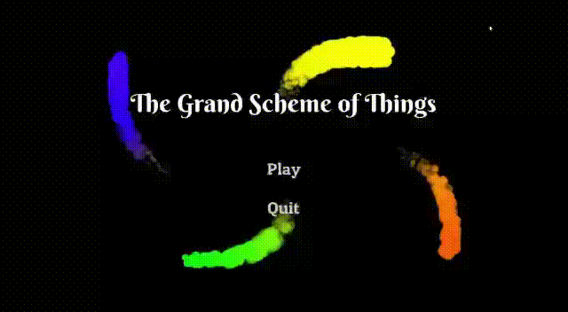

  
  

      God has created the ever-flowing river of Time and omnipresent gust of Truth. 
      Torn by Desire, Man scours the world for an answer. 
      What is right, and which is the path of Truth? Only Time will tell.
  

  <a href='https://www.youtube.com/watch?v=BIx0HM_9wcU'>Trailer</a>
  
  
  
  <h1> Gallery </h1>
  

      There are 4 entities, God, Time, Truth and Man. 
         
      God created Time, so Man could flow in the river of existence. God created Truth, so Man could fight it's ripple. But, God never told Man of their presence. 
  

  
  
  

      Upon Man, God bestowed the flower of Desire. Man gladly accepted, unbeknownst of its shackles.
  

  
  
  

      Truth is omnipresent. It manifests one of the many paths that Man has. 
  

  
  
  

      Man is a slave to his Desire.
  

  
  
  

    The paths of Truth & Desire may diverge...
  

  
  
  

      ..or converge.
  

  
  
  

      Time is ever-flowing. Without it, Man cannot exist.
  

  
  
  

      At the end of Man's journey, God welcomes him warmly. The pain of choice and the shackles of regret are undone.
  

  
     
  
  
  
  
  <h1> Prerequisites </h1>
  <a href='https://godotengine.org/download/windows'> Godot game engine ver3.2.1 </a>
  
  
  
  <h1> Getting Started </h1>
  

      1. Start up the engine (run the exe file, which in my case is Godot_v3.2.1-stable_win64.exe)
  

  

      2. Select the 'Import' option 
  

  
    
  

      3. Browse to where the project has been downloaded
  

    
  

      4. Select the 'project.godot' file, and open it
  

  
    
  

      5. Press the 'Play' button in the top right
  

  
    
  

      Enjoy! <a style="display: inline" href='https://docs.godotengine.org/en/stable/index.html'>Operating through Godot</a> is a breeze.
  

  
  
  
  <h1> Deployment </h1>
  

      1. Start up the engine. Make sure to pick the correct project.godot file.
       
      2. In the top-left, under the 'Project' section, select subsection 'Export..'. 
  

  

  

      3. A window will open. Pick the correct deployment environment (Windows desktop, in this case).
  

  
    
  

      4. Browse to where you want to deploy the game
  

  
    
  

      5. Make sure you want to set your desired options here (for example, you may set the deployed application icon here).
       
      6. Deploy it.
  

  
   
   
   
  <h1> Built with </h1>
  <ul>
      <li>
        Godot Engine ver3.2.1
      </li>
      <li>
      Aseprite ver1.1.6
      </li>
  </ul>
   
   
   
  <h1> Co-authors </h1>
  

      <a href='https://github.com/Rain1213'> Rain1213 </a>
       
      <a href='https://github.com/edgeemperor'> edgeemperor </a>
       
      <a href='https://github.com/d35r0n'> d35r0n </a>
  

   
   
   
  <h1> Acknowledgments </h1>
  

      This game was inspired entirely by Talib Kweli's verse on <a href='https://youtu.be/-DY94XFbocU?t=137'>The Truth by Pharoahe Monch</a>.
  

